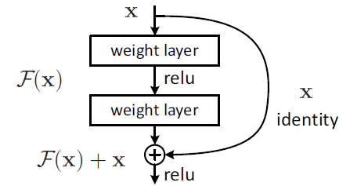

# ITCS8224_Fall_2021
DCGAN optimization with skip-connection

## Get Start
#### Download and install anaconda3
```
curl -O https://repo.anaconda.com/archive/Anaconda3-2021.05-Linux-x86_64.sh
bash Anaconda3-2021.05-Linux-x86_64.sh
```
Use ```sorce ~/.bashrc``` to refresh then can use ```conda```

#### Use conda to install cuda(cudatoolkit) and tensorflow(tensorflow-gpu)
```
(base)conda create -n py36 python=3.6
(base)conda activate py36
(py36)conda install cudatoolkit
(py36)conda install tensorflow-gpu
```

### Run HelloWorld code
```
(base)conda activate py36
(py36)python HelloWorld.py
(py36)conda deactivate
```

#### Submit job to cluster
```
sbatch basic-submit.slurm
```

Get msg:
```
Submitted batch job 1234567
```

Check status
```
squeue -j 1234567
```

```ST```=```PD``` indicates Pending

## Source for this course
environment: ```/projects/biomedimaging/biomedenv```

## Motivation
Related work: [Review: U-net+Resnet - The Importance of Long & Short Skip Connections(Biomedical Image Segmentation)](https://medium.datadriveninvestor.com/review-u-net-resnet-the-importance-of-long-short-skip-connections-biomedical-image-ccbf8061ff43)


## Implementation ideas
#### TODO: Implement a "scheduler" for inserting long & short skip-connections to the network to get better performance.
#### Sample Code:
Insert a short skip-connection to the network

```
# Set forward pass.
    def call(self, x, is_training=False):
        x = tf.reshape(x, [-1, 28, 28, 1])
        # Copy tensor: expectind a 4-D dataset
        y = x
        #
        x = self.conv1(x)
        x = self.bn1(x, training=is_training)
        x = tf.nn.leaky_relu(x)
        x = self.conv2(x)
        x = self.bn2(x, training=is_training)
        # Practice skip-connection: run 1*1 conv before addition
        y = self.conv_4_skip(y)
        x = layers.Add()[x, y]
        #
        x = tf.nn.leaky_relu(x)
        x = self.flatten(x)
        x = self.fc1(x)
        x = self.bn3(x, training=is_training)
        x = tf.nn.leaky_relu(x)
        return self.fc2(x)
```
